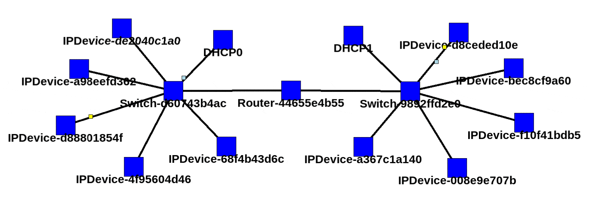

# NetworkSim
Educational Network Simulation Tool



## Overview
This project was started as a way to both learn and teach how networks work at the protocol level in a human-friendly time scale. As such, there are some "interesting" deviations from reality, particularly the "physical" layer and time, it is a _simulation_, after all. No code in here should be considered "production quality", and should be expected to contain vulnerabilities that have been patched in real-world implementations (but these could be fun to "exploit" in the simulation).

## Installing

```
python3 -m venv networksim
source networksim/bin/activate
pip install git+https://github.com/brwyatt/NetworkSim.git#egg=networksim
```

## Usage
### GUI

The GUI can be launched with the command `networksim` within the install environment.

Full usage guide: [Usage: GUI](https://github.com/brwyatt/NetworkSim/wiki/Usage:-GUI)

### Python (Advanced)

The simulator and other components can be used from within a REPL (such as iPython) or within other Python code.

Create a Simulation object with the following:

```
from networksim.simulation import Simulation

sim = Simulation()
```

Full usage guide: [Usage: Python (Advanced)](https://github.com/brwyatt/NetworkSim/wiki/Usage:-Python-(Advanced))

## Tutorials/Lessons

[Tutorials](https://github.com/brwyatt/NetworkSim/wiki#tutorialslessons)

## Example networks

[Examples](https://github.com/brwyatt/NetworkSim/wiki#example-networks)

## Limitations (Deviations from reality)

[Limitations](https://github.com/brwyatt/NetworkSim/wiki#limitations-deviations-from-reality)

## TODO
Known missing things that might get implemented

* ICMP Error messages - Currently missing, both generating/sending and processing received errors
* TCP - Requires a bit more tracking, still making sure the basics are all worked out
* VLANs - May require some rework of some parts to support, but likely worth implementing as the concepts are pretty useful
* (R)STP - Might be out of scope. Lets be honest, though, if you know what this is, this really isn't for you anyway. 😉
* Interface bonding and LACP - might be fun, might also be out of scope (at least short-term)
